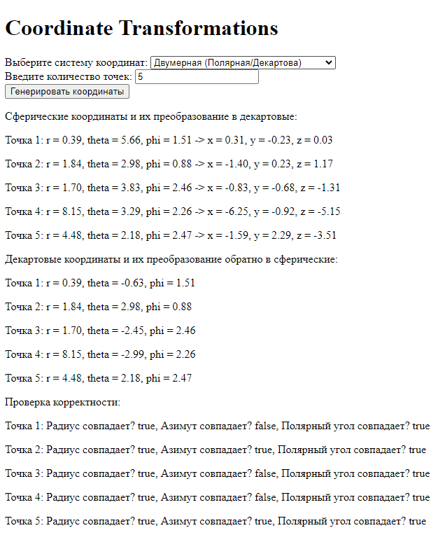
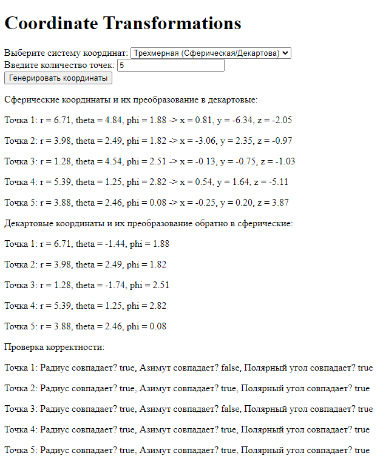
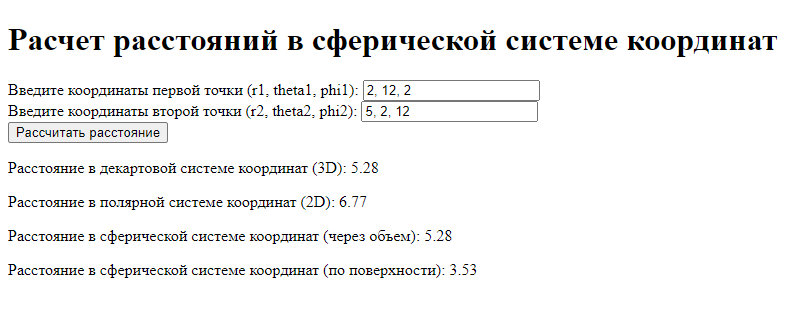
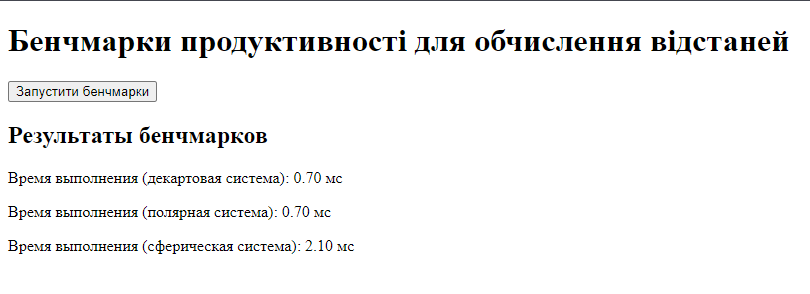

# Coordinate-Systems - Виконано
## Перехід між системами координат

1.1 Двовимірний простір: Декартова та полярна системи координат

Задати координати декількох точок у полярній системі координат.
Перевести ці координати в декартову систему координат.
Здійснити зворотний перехід з декартової системи координат в полярну.
Перевірити коректність розрахунків, упевнившись, що вихідні координати співпадають з отриманими після зворотного перетворення.

Для того, щоб перевести з одної системи координат у іншу, використовують формулу з полярної в декартову:

x = r * cos(ϴ)

y = r * sin(ϴ)

з декартової в полярну:
r = √(x^2 + y^2)

ϴ = arctan(y/x)

```javascript

// Функция для преобразования из сферической в декартову систему координат
function sphericalToCartesian(r, theta, phi) {
	const x = r * Math.sin(phi) * Math.cos(theta)
	const y = r * Math.sin(phi) * Math.sin(theta)
	const z = r * Math.cos(phi)
	return { x, y, z }
}

// Функция для преобразования из декартовой в сферическую систему координат
function cartesianToSpherical(x, y, z) {
	const r = Math.sqrt(x * x + y * y + z * z)
	const theta = Math.atan2(y, x) // Азимут
	const phi = Math.acos(z / r) // Полярный угол
	return { r, theta, phi }
}

// Функция для добавления текста на страницу
function appendToOutput(text) {
	const outputDiv = document.getElementById('output')
	const paragraph = document.createElement('p')
	paragraph.textContent = text
	outputDiv.appendChild(paragraph)
}

// Функция для обработки данных формы
function handleFormSubmit(event) {
	event.preventDefault() 

	// Получаем количество точек
	const pointsCount = parseInt(document.getElementById('pointsCount').value, 10)
	const sphericalPoints = []
	const cartesianPoints = []

	// Генерация случайных сферических координат и преобразование в декартовые
	for (let i = 0; i < pointsCount; i++) {
		const r = Math.random() * 10 // Радиус от 0 до 10
		const theta = Math.random() * 2 * Math.PI // Азимут от 0 до 2π
		const phi = Math.random() * Math.PI // Полярный угол от 0 до π
		sphericalPoints.push({ r, theta, phi })

		const cartesian = sphericalToCartesian(r, theta, phi)
		cartesianPoints.push(cartesian)
	}

	document.getElementById('output').innerHTML = ''

	appendToOutput('Сферические координаты и их преобразование в декартовые:')
	sphericalPoints.forEach((point, index) => {
		const cartesian = cartesianPoints[index]
		appendToOutput(
			`Точка ${index + 1}: r = ${point.r.toFixed(
				2
			)}, theta = ${point.theta.toFixed(2)}, phi = ${point.phi.toFixed(2)}` +
				` -> x = ${cartesian.x.toFixed(2)}, y = ${cartesian.y.toFixed(
					2
				)}, z = ${cartesian.z.toFixed(2)}`
		)
	})

	// Преобразование обратно в сферические координаты
	const sphericalConvertedPoints = cartesianPoints.map(point =>
		cartesianToSpherical(point.x, point.y, point.z)
	)

	appendToOutput(
		'\nДекартовые координаты и их преобразование обратно в сферические:'
	)
	sphericalConvertedPoints.forEach((point, index) => {
		appendToOutput(
			`Точка ${index + 1}: r = ${point.r.toFixed(
				2
			)}, theta = ${point.theta.toFixed(2)}, phi = ${point.phi.toFixed(2)}`
		)
	})

	// Проверка корректности
	appendToOutput('\nПроверка корректности:')
	sphericalPoints.forEach((original, index) => {
		const converted = sphericalConvertedPoints[index]
		const rMatches = Math.abs(original.r - converted.r) < 0.01
		const thetaMatches = Math.abs(original.theta - converted.theta) < 0.01
		const phiMatches = Math.abs(original.phi - converted.phi) < 0.01
		appendToOutput(
			`Точка ${
				index + 1
			}: Радиус совпадает? ${rMatches}, Азимут совпадает? ${thetaMatches}, Полярный угол совпадает? ${phiMatches}`
		)
	})
}

document
	.getElementById('coordinatesForm')
	.addEventListener('submit', handleFormSubmit)


```
Після натискання на кнопку "Генерувати координати".
Генеруються випадкові сферичні координати. Ці координати перетворюються на декартові. Перетворені координати знову перетворюються на сферичні для перевірки.

### Результат роботи:



## 2. Розрахунок відстаней у сферичній системі координат:

Виконати обчислення відстані між точками у сферичній системі координат двома способами:
Декартова система координат: Використати стандартну формулу для обчислення прямої відстані у двовимірному та тривимірному просторі.
Полярна система координат: Використати формулу для обчислення відстані між точками у двовимірному просторі.
Сферична система координат: Виконати обчислення відстані між точками двома способами:
Через об'єм сфери: використати формулу для прямої відстані у тривимірному просторі.
По поверхні сфери: використати формулу для великої колової відстані.

```javascript

// Функция для расчета расстояния в декартовой системе координат 
function distanceCartesian3D(x1, y1, z1, x2, y2, z2) {
	return Math.sqrt(
		Math.pow(x2 - x1, 2) + Math.pow(y2 - y1, 2) + Math.pow(z2 - z1, 2)
	)
}

// Функция для расчета расстояния в полярной системе координат 
function distancePolar2D(r1, theta1, r2, theta2) {
	return Math.sqrt(
		Math.pow(r1, 2) + Math.pow(r2, 2) - 2 * r1 * r2 * Math.cos(theta2 - theta1)
	)
}

// Функция для преобразования сферических координат в декартовы
function sphericalToCartesian(r, theta, phi) {
	const x = r * Math.sin(phi) * Math.cos(theta)
	const y = r * Math.sin(phi) * Math.sin(theta)
	const z = r * Math.cos(phi)
	return { x, y, z }
}

// Функция для расчета расстояния в сферической системе координат
function distanceSphericalVolume(r1, theta1, phi1, r2, theta2, phi2) {
	return Math.sqrt(
		Math.pow(r1, 2) +
			Math.pow(r2, 2) -
			2 *
				r1 *
				r2 *
				(Math.sin(phi1) * Math.sin(phi2) * Math.cos(theta1 - theta2) +
					Math.cos(phi1) * Math.cos(phi2))
	)
}

// Функция для расчета дуговой дистанции
function distanceSphericalSurface(r, phi1, phi2, theta1, theta2) {
	return (
		r *
		Math.acos(
			Math.sin(phi1) * Math.sin(phi2) +
				Math.cos(phi1) * Math.cos(phi2) * Math.cos(theta1 - theta2)
		)
	)
}

// Функция для обработки данных формы
function handleFormSubmit(event) {
	event.preventDefault() 

	const point1 = document.getElementById('point1').value.split(',').map(Number)
	const point2 = document.getElementById('point2').value.split(',').map(Number)

	const [r1, theta1, phi1] = point1
	const [r2, theta2, phi2] = point2

	// Преобразование в декартовые координаты
	const { x: x1, y: y1, z: z1 } = sphericalToCartesian(r1, theta1, phi1)
	const { x: x2, y: y2, z: z2 } = sphericalToCartesian(r2, theta2, phi2)

	// Расчеты расстояний
	const cartesianDistance = distanceCartesian3D(x1, y1, z1, x2, y2, z2)
	const polarDistance = distancePolar2D(r1, theta1, r2, theta2)
	const sphericalVolumeDistance = distanceSphericalVolume(
		r1,
		theta1,
		phi1,
		r2,
		theta2,
		phi2
	)
	const sphericalSurfaceDistance = distanceSphericalSurface(
		r1,
		phi1,
		phi2,
		theta1,
		theta2
	)

	const outputDiv = document.getElementById('output')
	outputDiv.innerHTML = `
        <p>Расстояние в декартовой системе координат (3D): ${cartesianDistance.toFixed(
					2
				)}</p>
        <p>Расстояние в полярной системе координат (2D): ${polarDistance.toFixed(
					2
				)}</p>
        <p>Расстояние в сферической системе координат (через объем): ${sphericalVolumeDistance.toFixed(
					2
				)}</p>
        <p>Расстояние в сферической системе координат (по поверхности): ${sphericalSurfaceDistance.toFixed(
					2
				)}</p>
    `
}

document
	.getElementById('distanceForm')
	.addEventListener('submit', handleFormSubmit)

```
Опис функцій:
- distanceCartesian3D: Рассчитывает расстояние между точками в декартовой системе координат (3D).
- distancePolar2D: Рассчитывает расстояние между точками в полярной системе координат (2D).
- sphericalToCartesian: Преобразует сферические координаты в декартовы.
- distanceSphericalVolume: Рассчитывает расстояние в сферической системе координат через объем.
- distanceSphericalSurface: Рассчитывает дуговую дистанцию (большую круговую дистанцию) между точками.

### Результат роботи


## 3. Бенчмарки продуктивності:

Згенерувати масив координат пар точок у кожній системі координат (декартова, полярна, сферична).
Виконати розрахунок відстаней між цими точками для кожної системи координат.
Виміряти тривалість обчислень для кожної системи координат.
Обрати такий розмір масиву, за якого результат бенчмаркінгу матиме незначну варіативність від запуску до запуску (рекомендовано розмір масиву 10,000 - 100,000 точок).

Наступний код генерує 10,000 випадкових тривимірних точок у декартових координатах та перетворює їх у полярні та сферичні координати. Потім він обчислює відстані між точками в декартовій, полярній та сферичній системах координат, використовуючи різні методи. Час, витрачений на розрахунки відстаней для кожної системи координат, вимірюється та виводиться на сторінку.

```javascript
// Генерация случайных координат в декартовой системе
function generateCartesianPoints(numPoints) {
	const points = []
	for (let i = 0; i < numPoints; i++) {
		const x = Math.random() * 100 
		const y = Math.random() * 100
		const z = Math.random() * 100
		points.push({ x, y, z })
	}
	return points
}

// Генерация случайных координат в полярной системе
function generatePolarPoints(numPoints) {
	const points = []
	for (let i = 0; i < numPoints; i++) {
		const r = Math.random() * 100 
		const theta = Math.random() * 2 * Math.PI // Угол в радианах
		points.push({ r, theta })
	}
	return points
}

// Генерация случайных координат в сферической системе
function generateSphericalPoints(numPoints) {
	const points = []
	for (let i = 0; i < numPoints; i++) {
		const r = Math.random() * 100 
		const theta = Math.random() * 2 * Math.PI 
		const phi = Math.random() * Math.PI 
		points.push({ r, theta, phi })
	}
	return points
}

// Функция для расчета расстояния в декартовой системе координат (3D)
function distanceCartesian3D(x1, y1, z1, x2, y2, z2) {
	return Math.sqrt(
		Math.pow(x2 - x1, 2) + Math.pow(y2 - y1, 2) + Math.pow(z2 - z1, 2)
	)
}

// Функция для расчета расстояния в полярной системе координат (2D)
function distancePolar2D(r1, theta1, r2, theta2) {
	return Math.sqrt(
		Math.pow(r1, 2) + Math.pow(r2, 2) - 2 * r1 * r2 * Math.cos(theta2 - theta1)
	)
}

// Функция для преобразования сферических координат в декартовы
function sphericalToCartesian(r, theta, phi) {
	const x = r * Math.sin(phi) * Math.cos(theta)
	const y = r * Math.sin(phi) * Math.sin(theta)
	const z = r * Math.cos(phi)
	return { x, y, z }
}

// Функция для расчета расстояния в сферической системе координат
function distanceSphericalVolume(r1, theta1, phi1, r2, theta2, phi2) {
	return Math.sqrt(
		Math.pow(r1, 2) +
			Math.pow(r2, 2) -
			2 *
				r1 *
				r2 *
				(Math.sin(phi1) * Math.sin(phi2) * Math.cos(theta1 - theta2) +
					Math.cos(phi1) * Math.cos(phi2))
	)
}

// Функция для запуска бенчмарков
function runBenchmarks() {
	const numPoints = 10000 

	// Генерация координат
	const cartesianPoints = generateCartesianPoints(numPoints)
	const polarPoints = generatePolarPoints(numPoints)
	const sphericalPoints = generateSphericalPoints(numPoints)

	// Время выполнения для декартовой системы
	const cartesianStartTime = performance.now()
	for (let i = 0; i < numPoints; i += 2) {
		const d = distanceCartesian3D(
			cartesianPoints[i].x,
			cartesianPoints[i].y,
			cartesianPoints[i].z,
			cartesianPoints[i + 1].x,
			cartesianPoints[i + 1].y,
			cartesianPoints[i + 1].z
		)
	}
	const cartesianEndTime = performance.now()
	const cartesianDuration = cartesianEndTime - cartesianStartTime

	// Время выполнения для полярной системы
	const polarStartTime = performance.now()
	for (let i = 0; i < numPoints; i += 2) {
		const d = distancePolar2D(
			polarPoints[i].r,
			polarPoints[i].theta,
			polarPoints[i + 1].r,
			polarPoints[i + 1].theta
		)
	}
	const polarEndTime = performance.now()
	const polarDuration = polarEndTime - polarStartTime

	// Время выполнения для сферической системы
	const sphericalStartTime = performance.now()
	for (let i = 0; i < numPoints; i += 2) {
		const {
			x: x1,
			y: y1,
			z: z1,
		} = sphericalToCartesian(
			sphericalPoints[i].r,
			sphericalPoints[i].theta,
			sphericalPoints[i].phi
		)
		const {
			x: x2,
			y: y2,
			z: z2,
		} = sphericalToCartesian(
			sphericalPoints[i + 1].r,
			sphericalPoints[i + 1].theta,
			sphericalPoints[i + 1].phi
		)
		const d = distanceCartesian3D(x1, y1, z1, x2, y2, z2)
	}
	const sphericalEndTime = performance.now()
	const sphericalDuration = sphericalEndTime - sphericalStartTime

	const outputDiv = document.getElementById('output')
	outputDiv.innerHTML = `
        <h2>Результаты бенчмарков</h2>
        <p>Время выполнения (декартовая система): ${cartesianDuration.toFixed(
					2
				)} мс</p>
        <p>Время выполнения (полярная система): ${polarDuration.toFixed(
					2
				)} мс</p>
        <p>Время выполнения (сферическая система): ${sphericalDuration.toFixed(
					2
				)} мс</p>
    `
}

document
	.getElementById('runBenchmarks')
	.addEventListener('click', runBenchmarks)
```

Функції generateCartesianPoints, generatePolarPoints і generateSphericalPoints створюють випадкові координати кожної системи координат. Використовуються функції розрахунку відстаней у різних системах координат.
Використовується performance.now() для вимірювання часу виконання кожного розрахунку. Після розрахунків результати відображаються на сторінці.

### Результат роботи: 


### Висновок: 

У рамках виконання лабораторних робіт на тему "Реалізація перетворень між системами координат" були досліджені та реалізовані різні аспекти роботи з координатами в двовимірному та тривимірному просторі.
